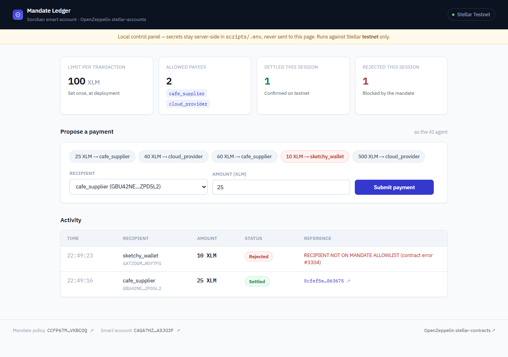

# Mandate Ledger

A human approves a spending mandate once. An AI agent then makes autonomous
payment decisions. A Soroban smart contract checks every decision against
the mandate before settlement on Stellar — violations are rejected on-chain,
visibly, not silently skipped.

Built on [OpenZeppelin's `stellar-accounts`](https://github.com/OpenZeppelin/stellar-contracts)
smart-account framework: the mandate (max amount per transaction + recipient
allowlist) is a custom `Policy` contract, installed on a Soroban smart
account's context rule. The agent authenticates with its own Ed25519 key
(a `Signer::External`, verified by a deployed verifier contract) — the
mandate is bound to that specific identity, not just "anyone who stays
under the limit."

**Live demo**: https://mandate.nataliaserranoortiz.com — a real control
panel that signs and submits actual testnet transactions through the
deployed contracts. Secrets live only in Vercel's environment variable
dashboard, never in this repo or the page itself.

**Slides**: [`docs/mandate-ledger-slides.pdf`](docs/mandate-ledger-slides.pdf)
— architecture, the mandate used in this demo, and screenshots of a real
run (settled + rejected payments, independently verifiable on
[stellar.expert](https://stellar.expert)).

<p align="center">
  
</p>

## Documentation

- [`docs/mandate-ledger-slides.pdf`](docs/mandate-ledger-slides.pdf) — the pitch deck (architecture, the mandate, live results)
- [`docs/screenshots/`](docs/screenshots/) — raw screenshots used in the deck above (dashboard, a settled+rejected run, the stellar.expert confirmation)

## Structure

- `contracts/` — Soroban/Rust contracts
  - `mandate-policy/` — the custom `Policy` implementing the mandate (max amount + allowlist, requires an authenticated signer)
  - `smart-account/` — the AI agent's smart account (built directly on `stellar-accounts`)
  - `ed25519-verifier/` — reusable verifier contract authenticating the agent's Ed25519 signer
- `scripts/` — the control panel (Node/Vercel serverless functions) that submits real payment decisions through the deployed contracts
  - `public/index.html` — the dashboard UI
  - `api/` — Vercel serverless functions (`/api/state`, `/api/decide`) that keep secrets server-side
  - `config.js`, `invoke.js`, `mandate-auth.js` — shared logic for building and submitting the custom Soroban authorization entries this smart account requires

## Running locally

```bash
cd scripts
npm install
cp .env.example .env   # fill in your own testnet keys — see below
node server.js         # http://localhost:4310
```

### Getting testnet keys

```bash
stellar keys generate my-agent-ops --network testnet --fund
stellar keys show my-agent-ops   # -> AGENT_OPS_SECRET
```

`AGENT_SIGNING_SECRET` is a raw Ed25519 keypair (any Stellar `Keypair.random()`
works) registered as the smart account's `Signer::External` pubkey — see
`scripts/deploy.md` for the full deployment walkthrough, and
`contracts/mandate-policy/src/mandate.rs` for the policy itself.

None of this repo's committed files contain real secrets — `.env` and
`scripts/agent-signing-key.json` are gitignored, and `deployed.json` holds
only public contract addresses.
